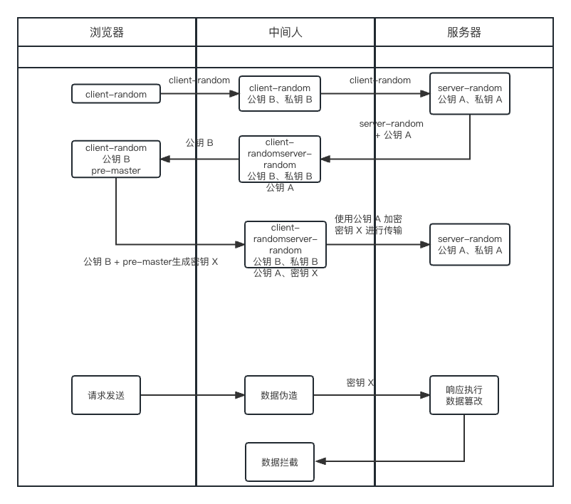

## https

### 安全背景

由于 http 是明文传输的，因此在传输过程中在浏览器和服务器之前的任何设备都有可能拦截到数据并伪造或者窃取数据信息进行网络攻击，这也就是`中间人攻击`.因此在这种安全隐患下，催生了 http 增加安全性相关的机制，`SSL/TSL` 加密层进行数据加密确保安全

### 什么是对称加密和非对称加密

#### 对称加密

`对称加密`即加密和解密都用的**同一个密钥**，这个密钥即可以用来加密也可以用来**解密同一个密钥加密的内容**。

#### 非对称加密

`非对称加密`即有两个密钥，一个可以当做公钥另外一个当做私钥，公钥加密的内容可以用私钥要解密，私钥加密的内容可以用公钥来解密，相互间做到你加我解的作用.但是缺点就是耗时高

### 加密策略演进

#### 第一版 对称加密

对称加密是否可行？答案当然是不可行的，问题比较多大。
因为是对称加密，且只有一个密钥，那么在浏览器和服务器之间都获取密钥的时候，都是明文传输的，而且两者之间发送的随机数和加密套件都是公开的，之后拿到随机数就可以自己合成密钥了，这就相当于还是明文传输.

**加密过程:**

1. 浏览器发送支持的加密套件列表和一个客户端随机数`client-random`
2. 服务器选择其中一个加密套件并生成服务端随机数`server-random`，并将加密套件和`server-random`返回给客户端
3. 客服端和服务端分别返回确认消息
4. 服务端和客服端都知道`client-random`和`server-random`，并将两者混合生成密钥`master-secret`
5. 两端根据`master-secret`和加密套件进行加密传输

#### 第二版 非对称加密

因为对称加密的问题，于是提出了非对称加密。  
客服端拿公钥进行数据加密，服务器拿私钥进行解密。看上去挺合理的，因为私钥只有服务器知道
对称加密是否可行？其实也不行，为啥呢？

因为公钥是服务端发放的，所以中间人也可以获取到公钥，那么服务端给客服端发送的数据也就不安全了

#### 第三版 非对称加密 + 对称加密搭配使用

整体的过程就是浏览器从服务器获取`公钥`，浏览器生成随机数搭配公钥进行加密生成`密钥X`并传到服务端，两端根据`密钥X`进行对称加密传输

**加密过程:**

1. 同对称加密，不同的是拿到了`client-random`和`server-random`
2. 浏览器再生成一个随机数`pre-master`
3. 将从从服务端拿到了`非对称加密公钥`用来加密`pre-master`生成`对称传输密钥X`。
4. 通过`对称传输密钥X`，两端进行对称加密传输

这种方式是否可靠呢？并不然，中间人依然可以伪造另一份公钥私钥，骗取浏览器端的密钥 X，实现中间人为代理的形式获取数据或者篡改数据

#### 第四版 数字证书（CA 证书）

在第三版中，其实中间人攻击的核心就是自己造了一份公钥密钥，来骗过浏览器或者了密钥 X。  
那么我们知道浏览器拿到的公钥是自己服务器的不就好啦！

因此出现了数字证书，数字证书相当于一个网站的身份证，包括了网站的一些信息以及公钥, 只要证明数字证书不是伪造的信息是真确，那么我们就有理由相信服务器传输的公钥是正确且安全的

**证明过程**

1. 数字证书上携带明文数据 T + 数字签名 S
2. 通过证书上的 hash 算法对明文进行 hash 得到 T', 使用数据证书上的公钥对签名进行解密得到 S'
3. T' = S' 则证明证书是可靠的，可以正常进行传输

那么中间人可以通过`伪造公钥`来实现获取密钥 X 传输吗？答案是不可以的
因为公钥在证书上，要伪造就需要`CA私钥`来解密，但是**私钥中间人是获取不到的**所以无法解密进行篡改

那么`调包证书`可行吗?比如拿 B 网站的证书来劫持 A 网站
答案也是不行的，因为 B 的证书不会，带有 A 网站的信息，证书验证不通过

还有该如何**证明证书中的公钥是可靠的**呢？  
其实数据证书的作用就是证明公钥的可靠性，所在在操作系统、浏览器中本身会预装一些信任的根证书  
如果其中装有该 CA 公司的根证书，就证明这个公钥是可靠的，不然的话会提示不安全需要安装证书啥的。  
且证书之前也是经过一层层的其他证书的链式证明来实现可靠性的
